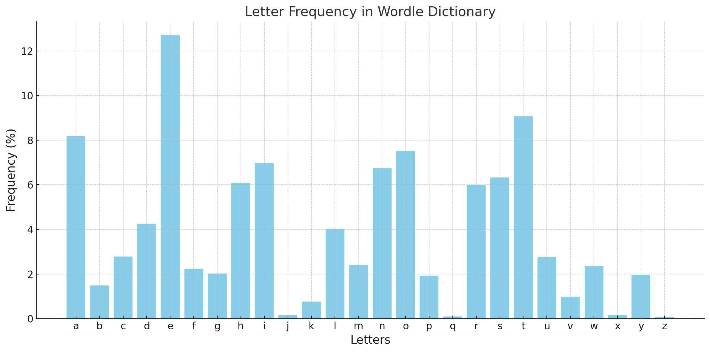
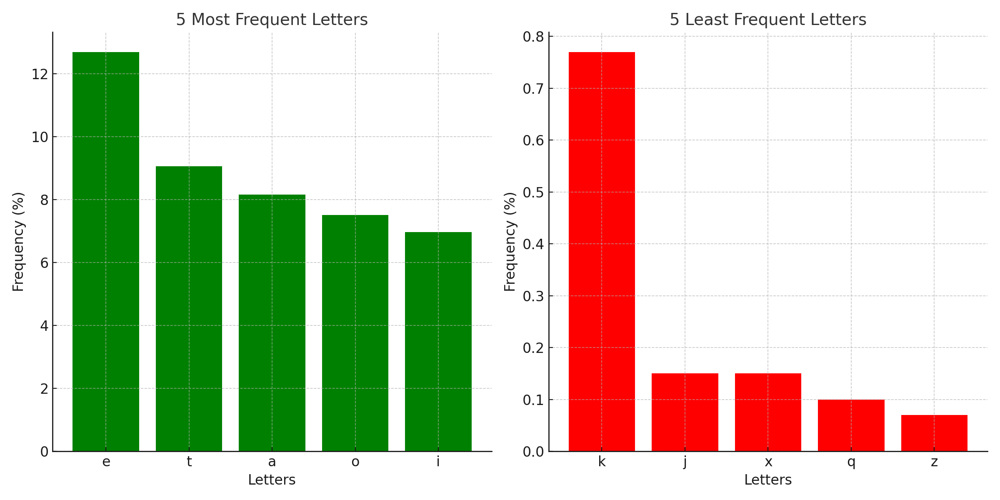
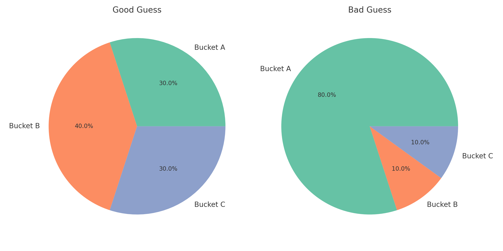

## Building a Wordle Analysis Tool

## Introduction
Yesterday, we explored using Python and Streamlit to create a simple web application. Today, we’re taking it further by combining web development with data science principles to solve a fun and popular challenge: Wordle!

Wordle is an excellent playground for applying basic statistics and data science. It’s simple, relatable, and offers plenty of opportunities to explore probability, entropy, and decision-making. To make things even better, I’ve built and deployed a Wordle Solver app using Python and Streamlit. You can try it out [here](https://wordle-solver.streamlit.app), or explore the code on [GitHub](https://github.com/j-abed/wordle-solver).

---

## Part 1: Why Wordle Makes for a Great Data Science Playground
1. **Popularity and Familiarity**  
   Wordle is a household name, with its straightforward rules and universal appeal. This makes it an ideal starting point for demonstrating data-driven decision-making.

2. **Data/Stats in Action**  
   Each guess in Wordle provides valuable feedback, narrowing the list of possible solutions. By analyzing this feedback, we can make smarter guesses.

3. **Simple, Yet Complex**  
   Wordle combines simplicity with strategic depth, making it a fantastic problem for exploring probability, statistics, and entropy.

**Visualization:** Here's a chart showing the frequency of letters in the Wordle dictionary. Notice how vowels like `E` dominate while less common letters like `Z` barely register.



**Most and Least Frequent Letters:** Below are the 5 most and 5 least frequent letters in Wordle.



### Why Letter Frequency Analysis Matters
In Wordle, the first guess is critical—it sets the stage for everything that follows. A good first guess uses common letters, increasing the likelihood of a match. 

For example:
- Words like **CRANE** or **SLATE** maximize the use of frequent letters (`E`, `A`, `T`).
- Conversely, words with rare letters, like **QUIZ** or **JUMPY**, are less effective at the start.

---

## Part 2: What is Entropy (and Why Does It Matter)?
### Entropy in Information Theory
Entropy is a measure of uncertainty. In Wordle, entropy helps us determine which guess provides the most "information gain." A good guess splits the remaining word list into evenly distributed subsets based on possible feedback patterns.

### Why High Entropy is Better
A high-entropy guess:
- Reduces the solution space more effectively.
- Ensures you don’t leave too many possibilities after one guess.

**Example:**
- A **good guess** splits 100 possible solutions into groups of 25, 25, 25, and 25 (high entropy).
- A **bad guess** leaves one group with 90 solutions and another with 10 (low entropy).

### Visualization: Good vs. Bad Guesses
Below are examples of how good and bad guesses partition the solution space:



---

## Part 3: Step-by-Step Instructions to Build the Wordle Solver App
### Prerequisites:
1. Install Python (3.7 or later).
2. Install Streamlit:
   ```bash
   pip install streamlit
   ```
3. Download the word lists: [words_alpha.txt](#) and [words_enable.txt](#) from GitHib (https://github.com/j-abed/wordle-solver)

---

### Step 1: Create the MVP (Minimal Viable Product)
**File:** `wordle_solver.py`

1. **Set up the environment**: Create a new Python file `wordle_solver.py`.
2. **Load the Wordle word list**:
   ```python
   def load_words(file_path):
       with open(file_path, 'r') as file:
           return [line.strip() for line in file if len(line.strip()) == 5]
   word_list = load_words('words_alpha.txt')
   ```
3. **Filter words based on feedback**:
   ```python
   def filter_words(word_list, guess, feedback):
       filtered = []
       for word in word_list:
           valid = True
           for i, (g, f) in enumerate(zip(guess, feedback)):
               if f == 'g' and word[i] != g:  # Green
                   valid = False
               elif f == 'y' and (g not in word or word[i] == g):  # Yellow
                   valid = False
               elif f == 'b' and g in word:  # Black
                   valid = False
           if valid:
               filtered.append(word)
       return filtered
   ```

4. **Add Streamlit UI**:
   ```python
   import streamlit as st

   st.title("Wordle Solver (MVP)")

   guess = st.text_input("Enter your guess:")
   feedback = st.text_input("Enter feedback (e.g., G for green, Y for yellow, _ for gray):")

   if st.button("Filter Words"):
       filtered_words = filter_words(word_list, guess, feedback)
       st.write("Remaining possible words:", filtered_words)
   ```

5. **Run the MVP app**:
   ```bash
   streamlit run wordle_solver.py
   ```

---

### Step 2: Add Entropy-Based Enhancement
**File:** `enhanced_wordle_solver.py`

1. **Simulate feedback for all guesses**:
   ```python
   def evaluate_guess(solution, guess):
       feedback = ['b'] * 5  # Default to black (incorrect)
       solution_chars = list(solution)

       # Green matches
       for i, (s, g) in enumerate(zip(solution, guess)):
           if s == g:
               feedback[i] = 'g'
               solution_chars[i] = None

       # Yellow matches
       for i, g in enumerate(guess):
           if feedback[i] == 'b' and g in solution_chars:
               feedback[i] = 'y'
               solution_chars[solution_chars.index(g)] = None

       return ''.join(feedback)
   ```

2. **Calculate entropy for each word**:
   ```python
   import math

   def calculate_entropy(guess, possible_words):
       feedback_buckets = {}
       for word in possible_words:
           feedback = evaluate_guess(guess, word)
           feedback_buckets[feedback] = feedback_buckets.get(feedback, 0) + 1

       total = sum(feedback_buckets.values())
       entropy = -sum(
           (count / total) * math.log2(count / total)
           for count in feedback_buckets.values()
       )
       return entropy
   ```

3. **Enhance the Streamlit UI**:
   ```python
   if st.button("Get Best Guess"):
       entropy_scores = {word: calculate_entropy(word, word_list) for word in word_list}
       best_guess = max(entropy_scores, key=entropy_scores.get)
       st.write("Best next guess:", best_guess)
   ```

---

## Part 4: Experiment with the Colab Notebook
Want to try your own experiments with Wordle strategies? I’ve created a [Colab Notebook](../public/day4/wordle_entropy_colab.ipynbwordle_entropy_colab.ipynb) where you can:
- Load the Wordle word list.
- Simulate guesses and calculate entropy.
- Explore which guesses work best for narrowing down possibilities.

---

## Part 5: Conclusion
With this app, you’ve built a fully functional Wordle solver that combines Python, Streamlit, and basic data science principles. Whether you’re playing Wordle or exploring applied statistics, this project demonstrates the power of data-driven decision-making.

**Next Steps:** How can these concepts extend to other games or real-world problems? Stay tuned for Day 5!

---


